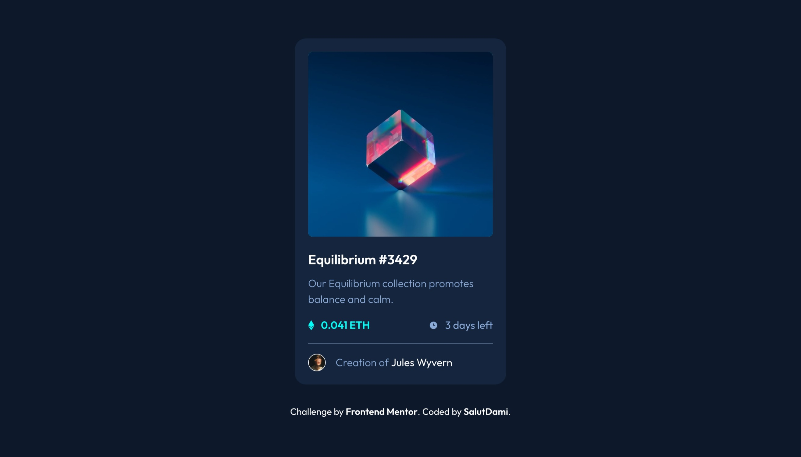
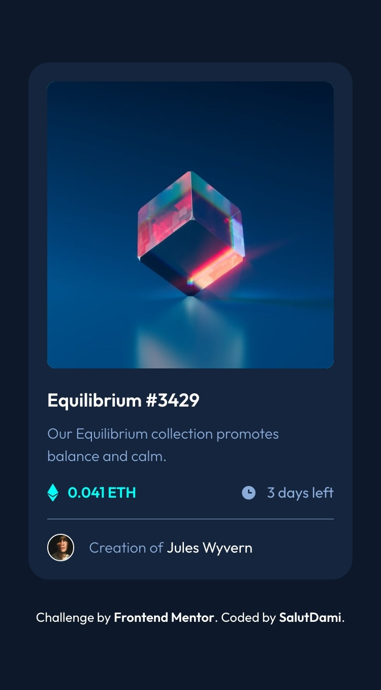

# Frontend Mentor - NFT preview card component solution

This is a solution to the [NFT preview card component challenge on Frontend Mentor](https://www.frontendmentor.io/challenges/nft-preview-card-component-SbdUL_w0U). Frontend Mentor challenges help you improve your coding skills by building realistic projects.

## Table of contents

- [Overview](#overview)
  - [The challenge](#the-challenge)
  - [Screenshot](#screenshot)
  - [Links](#links)
- [My process](#my-process)
  - [Built with](#built-with)
  - [What I learned](#what-i-learned)
- [Author](#author)

## Overview

### The challenge

Users would be able to:

- View the optimal layout depending on their device's screen size
- See hover states for interactive elements

### Screenshot



_A desktop view of the nft card component_



_A mobile view of the nft card component_

### Links

- Solution URL: [Add solution URL here](https://github.com/salutDami/nft-preview-card-component)
- Live Site URL: [Add live site URL here](https://salutdami.github.io/nft-preview-card-component/)

## My process

### Built with

- Semantic HTML5 markup
- CSS custom properties
- Flexbox
- Mobile-first workflow

### What I learned

Learnt how to add the hover effect which I initially found difficult but I was able to find the solution to the problem by using relative and abosule position with the opacity property and a pseudo-class.

You can see some snippets to how I solved this below:

```html
<figure class="nft_image_container">
  
  
</figure>
```

```css
.nft_image_container {
  border-radius: var(--radius-4);
  /* overflow: hidden; */
  margin-bottom: var(--space-4);
  position: relative;
  background-color: var(--cyan);
  cursor: pointer;
}

.nft_image_container .nft_image {
  height: auto;
  width: 100%;
  transition: all 0.7s;
  border-radius: var(--radius-4);
}

.eye {
  position: absolute;
  top: 50%;
  left: 50%;
  transform: translate(-50%, -50%);
  transition: all 0.7s;
  opacity: 0;
}

.nft_image_container:is(:hover) .nft_image {
  opacity: 0.5;
}

.nft_image_container:is(:hover) .eye {
  opacity: 1;
}
```

## Author

- Twitter - [@\_salutDami](https://www.twitter.com/_salutDami)
- Linkedin- [Ikuomola Stephen](https://www.linkedin.com/in/ikuomola-stephen/)
- Frontend Mentor - [@salutDami](https://www.frontendmentor.io/profile/salutDami)
